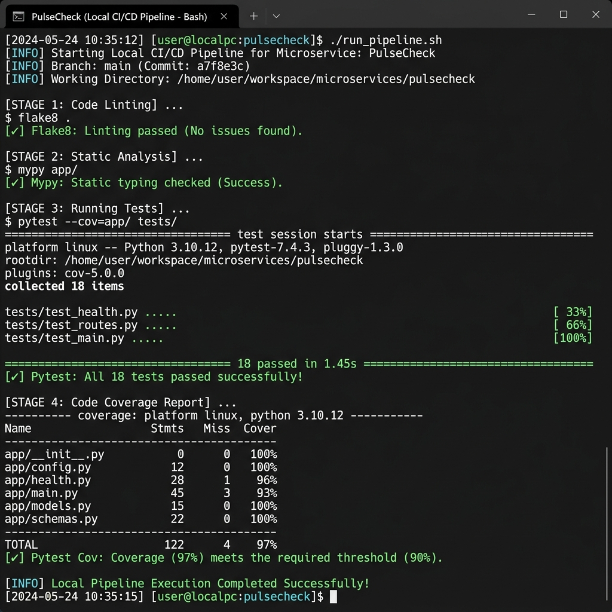

# PulseCheck 🩺

PulseCheck is a production-grade, highly-optimized health-monitoring microservice and real-time observability dashboard built with **FastAPI**, **Docker**, and **AWS ECS Fargate**. It acts as a lightweight daemon that tracks system health parameters and external API dependencies.

[](https://www.python.org/)
[](https://fastapi.tiangolo.com/)
[](https://www.docker.com/)


---

## Features

- **System Diagnostics**: Gathers real-time CPU, Virtual Memory, and Root Disk usage.
- **External Dependency Probing**: Health-checks connectivity to the GitHub API (`api.github.com`) using a robust HTTP session with exponential retries and backoff.
- **Content Negotiation**: Returns a responsive, glassmorphic live observability dashboard (`text/html`) to browser clients, while serving standard JSON payloads (`application/json`) to automated tools and API clients.
- **Event Log Streaming**: Streams service execution events inside a clean logs emulator widget directly on the dashboard.
- **Production Containerization**: Multi-stage Docker build separating compile-time dependencies from the final minimal runtime image, executing under a secure non-root user.

---

## Directory Structure

```
pulsecheck/
│
├── app/
│   ├── main.py              # FastAPI application, routing, and settings
│   ├── health.py            # Diagnostic collectors, retry sessions, logging configuration
│   └── requirements.txt     # Python application requirements
│
├── tests/
│   └── test_health.py       # pytest test suite covering all endpoints
│
├── .github/
│   └── workflows/
│       └── ci.yml           # GitHub Actions CI/CD pipeline definition
│
├── infrastructure/
│   └── cloudformation.yml   # AWS CloudFormation IaC for Serverless ECS Fargate
│
├── Dockerfile               # Multi-stage Docker configuration
├── docker-compose.yml       # Local multi-container orchestration configuration
├── run-pipeline.ps1         # Local CI/CD pipeline simulator for Windows PowerShell
├── run-pipeline.sh          # Local CI/CD pipeline simulator for macOS/Linux Bash
└── README.md                # Technical documentation
```

---

## Getting Started

### Prerequisites

- Python 3.11+
- Docker Desktop (optional, for containerization tasks)

### Local Development Setup

1. **Clone the repository**:
   ```bash
   git clone https://github.com/yvinayaka07/PulseCheck.git
   cd PulseCheck
   ```

2. **Initialize a virtual environment**:
   ```bash
   python -m venv .venv
   source .venv/bin/activate        # Windows: .venv\Scripts\activate
   ```

3. **Install application dependencies**:
   ```bash
   pip install -r app/requirements.txt
   pip install pytest pytest-cov httpx
   ```

4. **Launch the FastAPI application**:
   ```bash
   uvicorn app.main:app --reload --host 0.0.0.0 --port 8000
   ```

5. **Access the application endpoints**:
   - **Observability Dashboard**: [http://localhost:8000/](http://localhost:8000/) (Open in any web browser)
   - **Raw JSON Health Endpoint**: [http://localhost:8000/health](http://localhost:8000/health)
   - **Swagger API Documentation**: [http://localhost:8000/docs](http://localhost:8000/docs)


---

## Local Pipeline Simulator



You can simulate the entire CI/CD pipeline (Linting $\rightarrow$ Pytest Suite $\rightarrow$ Code Coverage reporting $\rightarrow$ Docker Multi-Stage Compilation $\rightarrow$ Background containerized smoke tests) in a single command.

- **On Windows (PowerShell)**:
  ```powershell
  Set-ExecutionPolicy Bypass -Scope Process
  .\run-pipeline.ps1
  ```
- **On macOS/Linux (Bash)**:
  ```bash
  chmod +x run-pipeline.sh
  ./run-pipeline.sh
  ```

---

## Containerization & Deployment

### Run using Docker Compose
```bash
docker compose up --build
```

### Manual Docker Build
```bash
docker build -t pulsecheck:latest .
```

---

## Automated Test Suite

The test suite performs comprehensive diagnostics testing, including endpoint response schemas, metric boundaries, and mocking external connectivity errors (connection failure, timeouts, HTTP 403) to verify the automatic retry sessions.

### Run tests manually
```bash
python -m pytest tests/ --cov=app -v
```

---

## Infrastructure as Code (AWS ECS Fargate)

PulseCheck uses a Serverless CaaS model (**AWS ECS Fargate**) for compute resources, which provides zero idle-resource costs and eliminates host OS patching overhead. 

The configuration template is fully defined in [infrastructure/cloudformation.yml](file:///c:/Users/user/Desktop/pulsecheck/infrastructure/cloudformation.yml) and provisions:
- **ECS Fargate Cluster** & ECS Task Definition (`0.25 vCPU`, `0.5 GB RAM`)
- **ECS Service** with network mappings
- **AWS CloudWatch Log Group** for centralized logging
- Tight-scope **IAM Execution Roles**

---

## Example Health Response (`GET /health`)

```json
{
  "status": "healthy",
  "timestamp": "2026-05-19T13:48:35.123456+00:00",
  "cpu_usage_percent": 12.5,
  "memory_usage_percent": 64.2,
  "disk_usage_percent": 48.9,
  "external_api_status": "reachable"
}
```

---

## License

This project is licensed under the MIT License.
