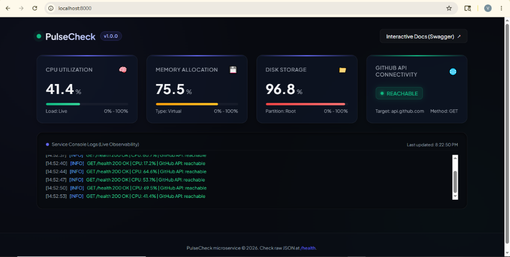
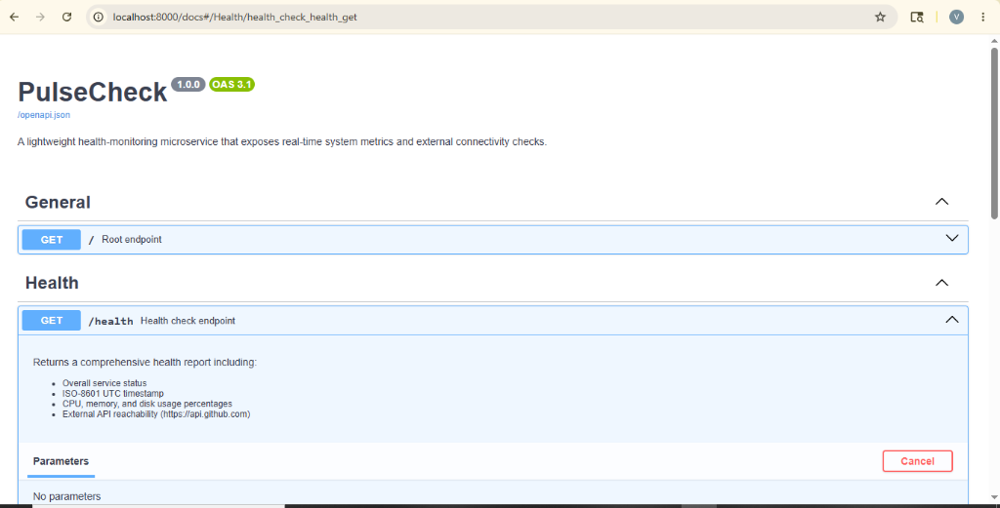
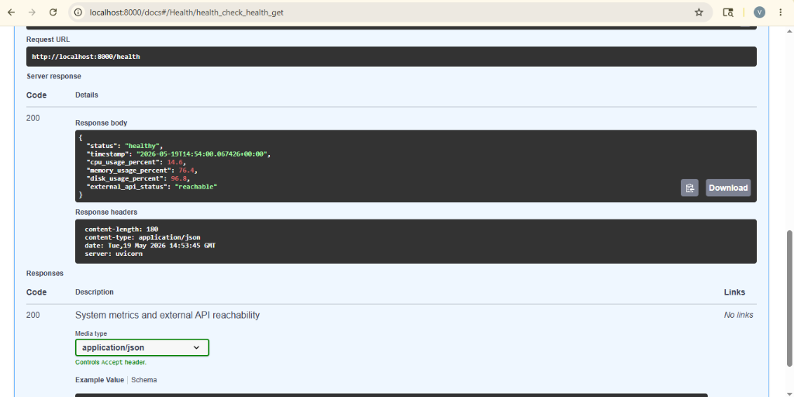

# PulseCheck 🩺

PulseCheck is a production-grade, highly-optimized health-monitoring microservice and real-time observability dashboard built with **FastAPI**, **Docker**, and **AWS ECS Fargate**. It acts as a lightweight daemon that tracks system health parameters and external API dependencies.

[](https://www.python.org/)
[](https://fastapi.tiangolo.com/)
[](https://www.docker.com/)



---

## System Architecture

PulseCheck's end-to-end architecture is built for high reliability, automated local/remote verification, and resilient cloud hosting. 

Below is the **Complete End-to-End Project Architecture Diagram**, illustrating the entire system lifecycle—from local development and CI/CD pipelines to containerization, AWS ECS Fargate serverless hosting, internal FastAPI application runtime, system metrics collection, and external probing:

```mermaid
graph TB
    %% Styling classes
    classDef dev fill:#f8fafc,stroke:#475569,stroke-width:2px,color:#0f172a;
    classDef pipeline fill:#818cf8,stroke:#4f46e5,stroke-width:2px,color:#fff;
    classDef aws fill:#ff9900,stroke:#d05c00,stroke-width:2px,color:#fff;
    classDef app fill:#10b981,stroke:#047857,stroke-width:2px,color:#fff;
    classDef target fill:#ef4444,stroke:#b91c1c,stroke-width:2px,color:#fff;

    subgraph DevWorkspace ["Developer & CI/CD Lifecycle"]
        Code["Local Codebase<br/>(Python/Docker/CFn)"]:::dev
        Sim["Local Pipeline Simulator<br/>(run-pipeline.sh/.ps1)"]:::dev
        GHA["GitHub Actions CI/CD<br/>(ci.yml)"]:::pipeline
        
        subgraph GHAPipeline ["GitHub Actions Pipeline Jobs"]
            TestJob["1. Lint & Test<br/>(pytest + coverage)"]:::pipeline
            BuildJob["2. Build & Smoke Test<br/>(Multi-stage Docker)"]:::pipeline
            DeployJob["3. Simulate Deployment<br/>(AWS dry-run)"]:::pipeline
        end
    end

    subgraph RegistryMgmt ["AWS Management & Registry"]
        ECR["Amazon Elastic Container Registry (ECR)<br/>(pulsecheck:latest)"]:::aws
        IAM["AWS IAM Roles & Policies<br/>(ECSTaskExecutionRole)"]:::aws
        CW["Amazon CloudWatch Logs<br/>(/ecs/pulsecheck)"]:::aws
    end

    subgraph CloudRuntime ["AWS Production Runtime Environment (ECS Fargate)"]
        subgraph VPC ["AWS VPC (Virtual Private Cloud)"]
            subgraph Subnets ["Public/Private Subnets (Multi-AZ)"]
                ALB["AWS Application Load Balancer / DNS"]:::aws
                SG["ECS Security Group<br/>(Inbound TCP 8000)"]:::aws
                
                subgraph ECSCluster ["ECS Cluster & Fargate Capacity"]
                    subgraph FargateTask ["ECS Fargate Task"]
                        subgraph DockerContainer ["Docker Container Runtime"]
                            subgraph FastAPIApp ["FastAPI Application (app/main.py)"]
                                Router["Routing / Endpoints<br/>(/ & /health)"]:::app
                                Dashboard["Live Dashboard<br/>(DASHBOARD_HTML)"]:::app
                                Engine["Health Engine<br/>(app/health.py)"]:::app
                            end
                        end
                    end
                end
            end
        end
    end

    subgraph Targets ["System & External Targets"]
        HostOS["Host OS Metrics<br/>(CPU, Memory, Disk via psutil)"]:::target
        GitAPI["GitHub API Gateway<br/>(api.github.com)"]:::target
        Browser["User Web Browser"]:::dev
        APIClient["API Client / Monitor"]:::dev
    end

    %% Lifecycle Flows
    Code -->|Simulates Pipeline| Sim
    Code -->|git push main| GHA
    GHA --> TestJob
    TestJob -->|On Success| BuildJob
    BuildJob -->|On Success| DeployJob
    DeployJob -->|Upload Docker Image| ECR
    
    %% Infrastructure & Runtime Pulls
    FargateTask -.->|1. Authenticate & Pull Image| ECR
    FargateTask -.->|2. Fetch execution permissions| IAM
    DockerContainer -->|3. Push stdout/stderr logs| CW

    %% Traffic Routing
    Browser -->|HTTP GET / (HTML)| ALB
    APIClient -->|HTTP GET /health (JSON)| ALB
    ALB -->|Forward traffic| SG
    SG -->|Access| Router
    
    %% Application Internal Flow
    Router -->|Serves UI| Dashboard
    Router -->|Triggers report| Engine
    Dashboard -->|Poll /health every 3s| Router
    
    %% Metrics & Checks Gathering
    Engine -->|psutil queries| HostOS
    Engine -->|requests HTTP GET| GitAPI
```

### Architectural Breakdown

1. **Development & Automation**: Developers can either simulate the entire integration pipeline locally (`run-pipeline`) or push to the `main` branch to trigger the **GitHub Actions CI/CD** pipeline (`ci.yml`).
2. **CI/CD Pipeline Workflow**:
   - **Test**: Installs dependencies and runs `pytest` with code coverage reports.
   - **Build**: Compiles a production-ready, multi-stage Docker image and runs a containerized smoke test.
   - **Deploy**: Authenticates with Amazon ECR, pushes the new container image, and triggers an rolling-deployment update of the AWS ECS Service.
3. **AWS Cloud Fargate Infrastructure**:
   - The deployment is defined via **Infrastructure-as-Code** ([cloudformation.yml](infrastructure/cloudformation.yml)).
   - Provisions an **ECS Cluster** utilizing serverless Fargate tasks behind a Security Group.
   - Task execution uses tight-scope **IAM execution roles** to pull images from **ECR** and streams diagnostic logs directly to **Amazon CloudWatch**.
4. **FastAPI Application & Live Diagnostics**:
   - Inside the container, FastAPI serves either a responsive glassmorphic dashboard (for HTML/browser users) or structured JSON (for automated API consumers).
   - In the background, the health-checking service collects hardware metrics via `psutil` and tests connectivity to the GitHub API using a `requests` session built with automatic retry-and-backoff behavior.

---

## Features

- **System Diagnostics**: Gathers real-time CPU, Virtual Memory, and Root Disk usage.
- **External Dependency Probing**: Health-checks connectivity to the GitHub API (`api.github.com`) using a robust HTTP session with exponential retries and backoff.
- **Content Negotiation**: Returns a responsive, glassmorphic live observability dashboard (`text/html`) to browser clients, while serving standard JSON payloads (`application/json`) to automated tools and API clients.
- **Event Log Streaming**: Streams service execution events inside a clean logs emulator widget directly on the dashboard.
- **Production Containerization**: Multi-stage Docker build separating compile-time dependencies from the final minimal runtime image, executing under a secure non-root user.

---

## Directory Structure

```
pulsecheck/
│
├── app/
│   ├── main.py              # FastAPI application, routing, and settings
│   ├── health.py            # Diagnostic collectors, retry sessions, logging configuration
│   └── requirements.txt     # Python application requirements
│
├── tests/
│   └── test_health.py       # pytest test suite covering all endpoints
│
├── .github/
│   └── workflows/
│       └── ci.yml           # GitHub Actions CI/CD pipeline definition
│
├── infrastructure/
│   └── cloudformation.yml   # AWS CloudFormation IaC for Serverless ECS Fargate
│
├── Dockerfile               # Multi-stage Docker configuration
├── docker-compose.yml       # Local multi-container orchestration configuration
├── run-pipeline.ps1         # Local CI/CD pipeline simulator for Windows PowerShell
├── run-pipeline.sh          # Local CI/CD pipeline simulator for macOS/Linux Bash
└── README.md                # Technical documentation
```

---

## Getting Started

### Prerequisites

- Python 3.11+
- Docker Desktop (optional, for containerization tasks)

### Local Development Setup

1. **Clone the repository**:
   ```bash
   git clone https://github.com/yvinayaka07/PulseCheck.git
   cd PulseCheck
   ```

2. **Initialize a virtual environment**:
   ```bash
   python -m venv .venv
   source .venv/bin/activate        # Windows: .venv\Scripts\activate
   ```

3. **Install application dependencies**:
   ```bash
   pip install -r app/requirements.txt
   pip install pytest pytest-cov httpx
   ```

4. **Launch the FastAPI application**:
   ```bash
   uvicorn app.main:app --reload --host 0.0.0.0 --port 8000
   ```

5. **Access the application endpoints**:
   - **Observability Dashboard**: [http://localhost:8000/](http://localhost:8000/) (Open in any web browser)
   - **Raw JSON Health Endpoint**: [http://localhost:8000/health](http://localhost:8000/health)
   - **Swagger API Documentation**: [http://localhost:8000/docs](http://localhost:8000/docs)



---

## Local Pipeline Simulator

You can simulate the entire CI/CD pipeline (Linting $\rightarrow$ Pytest Suite $\rightarrow$ Code Coverage reporting $\rightarrow$ Docker Multi-Stage Compilation $\rightarrow$ Background containerized smoke tests) in a single command.

- **On Windows (PowerShell)**:
  ```powershell
  Set-ExecutionPolicy Bypass -Scope Process
  .\run-pipeline.ps1
  ```
- **On macOS/Linux (Bash)**:
  ```bash
  chmod +x run-pipeline.sh
  ./run-pipeline.sh
  ```

### Example Simulation Output

```text
====================================================
 🩺 PulseCheck Local CI/CD Pipeline Simulator
====================================================

[1/3] Running automated unit and integration tests...
============================= test session starts =============================
platform win32 -- Python 3.13.2, pytest-9.0.3, pluggy-1.6.0
rootdir: C:\Users\user\Desktop\pulsecheck
plugins: anyio-4.13.0, cov-7.1.0
collected 21 items

tests\test_health.py .....................                               [100%]

=============================== tests coverage ================================
Name            Stmts   Miss  Cover   Missing
---------------------------------------------
app\health.py     104     34    67%   49, 75-85, 94-96, 105-107, 116-118, 143-151, 158-179
app\main.py        35      4    89%   51, 59, 602, 643
---------------------------------------------
TOTAL             139     38    73%
======================= 21 passed, 5 warnings in 1.88s ========================
✅ All tests passed successfully!

Checking local containerization environment...
⚠️  Docker is not installed or not in system PATH.
Skipping containerization steps. Install Docker to test multi-stage builds locally.

====================================================
 🎉 Local Pipeline Passed (Tests Only - Docker Skipped)
====================================================
```

---

## Containerization & Deployment

### Run using Docker Compose
```bash
docker compose up --build
```

### Manual Docker Build
```bash
docker build -t pulsecheck:latest .
```

---

## Automated Test Suite

The test suite performs comprehensive diagnostics testing, including endpoint response schemas, metric boundaries, and mocking external connectivity errors (connection failure, timeouts, HTTP 403) to verify the automatic retry sessions.

### Run tests manually
```bash
python -m pytest tests/ --cov=app -v
```

---

## Infrastructure as Code (AWS ECS Fargate)

PulseCheck uses a Serverless CaaS model (**AWS ECS Fargate**) for compute resources, which provides zero idle-resource costs and eliminates host OS patching overhead. 

The configuration template is fully defined in [infrastructure/cloudformation.yml](file:///c:/Users/user/Desktop/pulsecheck/infrastructure/cloudformation.yml) and provisions:
- **ECS Fargate Cluster** & ECS Task Definition (`0.25 vCPU`, `0.5 GB RAM`)
- **ECS Service** with network mappings
- **AWS CloudWatch Log Group** for centralized logging
- Tight-scope **IAM Execution Roles**

---

## Example Health Response (`GET /health`)



```json
{
  "status": "healthy",
  "timestamp": "2026-05-19T13:48:35.123456+00:00",
  "cpu_usage_percent": 12.5,
  "memory_usage_percent": 64.2,
  "disk_usage_percent": 48.9,
  "external_api_status": "reachable"
}
```

